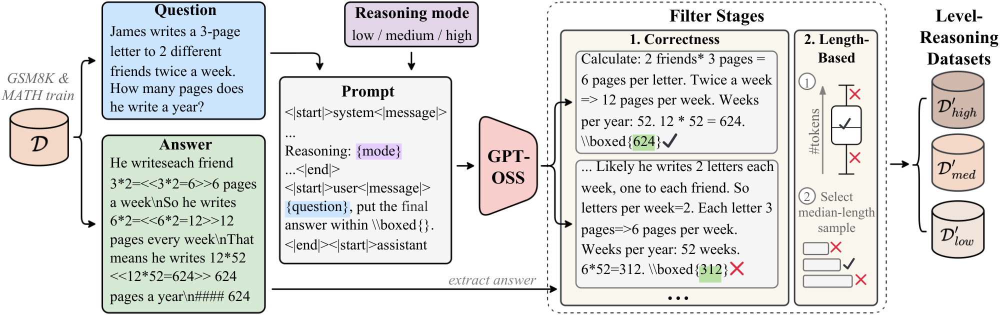

<p align="center">
  
  &nbsp;&nbsp;&nbsp;
  
</p>

<h1 align="center">Curating Multi-Mode CoT for Efficient Math Reasoning with GPT-OSS</h1>

<p align="center">
  <a href="https://github.com/Koii2k3/LLaMA-OSS/blob/main/LICENSE">
    
  </a>
  <a href="">
    
  </a>
  <a href="">
    
  </a>
</p>

</div>

<p align="center">
  
</p>

This repository contains the official implementation for **LLaMA-OSS**, the official implementation of our knowledge distillation framework that curates multi-mode chain-of-thought (CoT) reasoning from **GPT-OSS** for efficient mathematical question answering. Our approach addresses the challenge of noisy and overly verbose supervision in dataset-based distillation by implementing a two-step curation pipeline that emphasizes quality over quantity.

This framework is built with a focus on modularity, performance, and ease of use, making it suitable for both research and practical applications.

<details>
<summary><b>Table of Contents</b></summary>

- [Features](#features)
- [Experimental Results](#experimental-results)
  - [GSM8K Results](#gsm8k-results)
  - [MATH500 Results](#math500-results)
- [Getting Started](#getting-started)
  - [Setup and Installation](#setup-and-installation)
  - [Usage](#usage)
- [Framework Guides](#framework-guides)
  - [Configuration](#configuration)
  - [Evaluation](#evaluation)
- [Programmatic Usage](#programmatic-usage)
- [Citation](#citation)
- [Acknowledgements](#acknowledgements)

</details>

## Features

- **Multi-Mode CoT Generation**: Leverages GPT-OSS's low/medium/high inference modes for controllable reasoning generation
- **Two-Step Curation Pipeline**: 
  - Final-answer verification to filter incorrect reasoning traces
  - Length distribution-based filtering with median-length selection to eliminate verbosity
- **SFT + GRPO Training**: Complete pipeline from supervised fine-tuning to policy optimization
- **Comprehensive Evaluation**: Automated evaluation on GSM8K and MATH500 benchmarks
- **LLaMA-Factory Integration**: Built on LLaMA-Factory for efficient training workflows
- **MS-SWIFT Support**: Compatible with ModelScope-SWIFT framework
- **Modular Design**: Easy to extend for other reasoning tasks or teacher models

## Experimental Results

All experiments use **Llama 3.2 3B** as the student model, distilled from GPT-OSS teacher models.

### GSM8K Results

| Model | Training | Dataset | GSM8K 0-shot | GSM8K 5-shot |
|-------|----------|---------|--------------|--------------|
| Llama3.2 | - | 𝒟<sub>orig</sub> | 0.7043 | 0.7043 |
| Llama3.2 | - | 𝒟<sup>*</sup> | 0.7043 | 0.7104 |
| Llama3.2 | SFT | 𝒟<sup>*</sup> | 0.6876 | 0.5762 |
| Llama3.2 | SFT | 𝒟<sup>*</sup><sub>low</sub> | **0.7111** | **0.7142** |
| Llama3.2 | SFT | 𝒟<sup>*</sup><sub>med</sub> | 0.7051 | 0.7074 |
| Llama3.2 | SFT | 𝒟<sup>*</sup><sub>high</sub> | 0.7013 | 0.7051 |
| Llama3.2-𝒟<sub>orig</sub> | GRPO | 𝒟 | 0.7771 | 0.6603 |
| Llama3.2-𝒟<sup>*</sup> | GRPO | 𝒟 | 0.7847 | 0.6156 |
| Llama3.2-𝒟<sup>*</sup><sub>low</sub> | GRPO | 𝒟 | 0.6308 | 0.5861 |
| Llama3.2-𝒟<sup>*</sup><sub>low</sub> | **GRPO** | 𝒟 | **0.8006** | 0.7195 |
| Llama3.2-𝒟<sup>*</sup><sub>med</sub> | GRPO | 𝒟 | 0.7771 | 0.6323 |
| Llama3.2-𝒟<sup>*</sup><sub>high</sub> | GRPO | 𝒟 | 0.7559 | **0.7225** |


### MATH500 Results

| Model | Training | Dataset | MATH500 0-shot | MATH500 4-shot |
|-------|----------|---------|----------------|----------------|
| Llama3.2 | - | 𝒟<sub>orig</sub> | 0.3960 | 0.4340 |
| Llama3.2 | - | 𝒟<sup>*</sup> | 0.4060 | 0.4240 |
| Llama3.2 | SFT | 𝒟<sup>*</sup> | 0.3400 | 0.2420 |
| Llama3.2 | SFT | 𝒟<sup>*</sup><sub>low</sub> | 0.4100 | **0.4400** |
| Llama3.2 | SFT | 𝒟<sup>*</sup><sub>med</sub> | 0.4000 | 0.4160 |
| Llama3.2 | SFT | 𝒟<sup>*</sup><sub>high</sub> | **0.4140** | 0.3920 |
| Llama3.2-𝒟<sub>orig</sub> | GRPO | 𝒟 | 0.4540 | 0.4380 |
| Llama3.2-𝒟<sup>*</sup> | GRPO | 𝒟 | 0.4520 | 0.4560 |
| Llama3.2-𝒟<sup>*</sup><sub>low</sub> | GRPO | 𝒟 | 0.4400 | 0.4220 |
| **Llama3.2-𝒟<sup>*</sup><sub>low</sub>** | **GRPO** | 𝒟 | **0.4760** | 0.4520 |
| Llama3.2-𝒟<sup>*</sup><sub>med</sub> | GRPO | 𝒟 | 0.4480 | **0.4600** |
| Llama3.2-𝒟<sup>*</sup><sub>high</sub> | GRPO | 𝒟 | 0.4740 | **0.4600** |


## Getting Started

To get started with the framework, please follow the detailed setup and usage guides.

### Setup and Installation

Our comprehensive setup guide provides detailed instructions for environment preparation, dependency installation, and model/dataset acquisition. It covers system requirements, virtual environment setup, and verification steps to ensure a smooth start.

**➡️ [View Full Setup Guide](./common/md/SETUP.md)**

### Usage

The usage guide explains how to run inference, perform batch processing, and evaluate models on benchmark datasets. It includes command-line examples for various scenarios.

**➡️ [View Full Usage Guide](./common/md/USAGE.md)**

## Framework Guides

For advanced users and researchers, we provide in-depth guides on configuring the framework and running evaluation protocols.

### Configuration

The configuration system is designed for flexibility. You can easily modify data paths, model parameters, and processing settings. This guide details the structure of the configuration files and how to customize them.

**➡️ [View Full Configuration Guide](./common/md/CONFIG.md)**

### Evaluation

This guide provides instructions on how to run the evaluation scripts, interpret the results, and perform comparative analysis between different models and configurations.

**➡️ [View Full Evaluation Guide](./common/md/EVALUATION.md)**

## Programmatic Usage

The modular design of the framework allows for easy integration into your own Python projects. You can import and use the components directly for custom workflows.

```python
from src.curation import CurationPipeline, AnswerVerifier, LengthFilter
from src.generator import GPTOSSGenerator

# 1. Setup the GPT-OSS generator for multi-mode CoT
generator = GPTOSSGenerator(
    model_name='gpt-4o',
    modes=['low', 'medium', 'high']
)

# 2. Generate CoT traces from your math dataset
math_problems = [
    {"question": "What is 15 + 27?", "answer": "42"},
    {"question": "Janet's ducks lay 16 eggs per day...", "answer": "18"}
]

cot_data = generator.generate_multi_mode_cot(
    problems=math_problems,
    output_path='raw_cot_data.jsonl'
)

# 3. Apply the two-step curation pipeline
curation = CurationPipeline(
    answer_verifier=AnswerVerifier(),
    length_filter=LengthFilter(percentile_range=(25, 75))
)

# Step 1: Answer verification
verified_data = curation.verify_answers(cot_data)

# Step 2: Length-based filtering with median selection
curated_data = curation.filter_by_length(verified_data, select_median=True)

# 4. Save mode-specific curated datasets
curation.save_by_mode(
    curated_data,
    output_dir='outputs',
    filenames={
        'low': 'cot_low.jsonl',
        'medium': 'cot_med.jsonl',
        'high': 'cot_high.jsonl'
    }
)

print(f"Curated {len(curated_data)} high-quality reasoning traces")
print(f"Files saved: cot_low.jsonl, cot_med.jsonl, cot_high.jsonl")
```

## Citation

If you use this framework or find our work helpful, please consider citing:

```bibtex
@misc{llama-oss-2025,
  author    = {Hai-Au Trinh, Tue-Anh Vu, Dai-Nhan Tran, Uyen Khoi-Minh Huynh, Anh-Khoi Nguyen},
  title     = {Curating Multi-Mode CoT for Efficient Math Reasoning with GPT-OSS},
  year      = {2025},
  publisher = {},
  journal   = {},
  howpublished = {\url{https://github.com/Koii2k3/LLaMA-OSS}},
}
```

## Acknowledgements

This project is built upon the excellent work of several open-source projects and research contributions. We would like to extend our gratitude to:
- The teams behind [LLaMA-Factory](https://github.com/hiyouga/LLaMA-Factory) and [MS-SWIFT](https://github.com/modelscope/swift) for their high-performance inference libraries.
- [Meta LLaMA](https://ai.meta.com/llama/) - Foundation model
- The Hugging Face team for the `transformers` and `accelerate` libraries.

Special thanks to the research community for advancing efficient LLM training techniques.

---

**Note**: This is an active research project. Contributions, issues, and feature requests are welcome! Please check our [contributing guidelines](CONTRIBUTING.md) before submitting PRs.